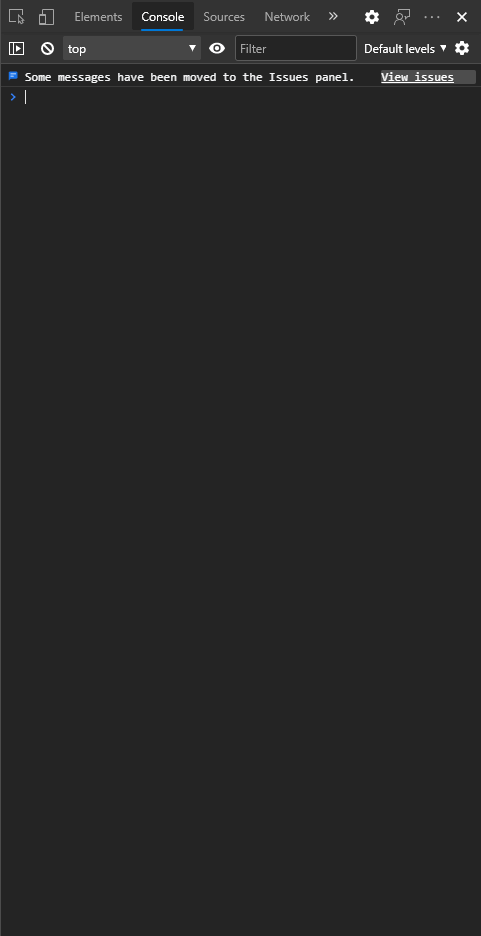
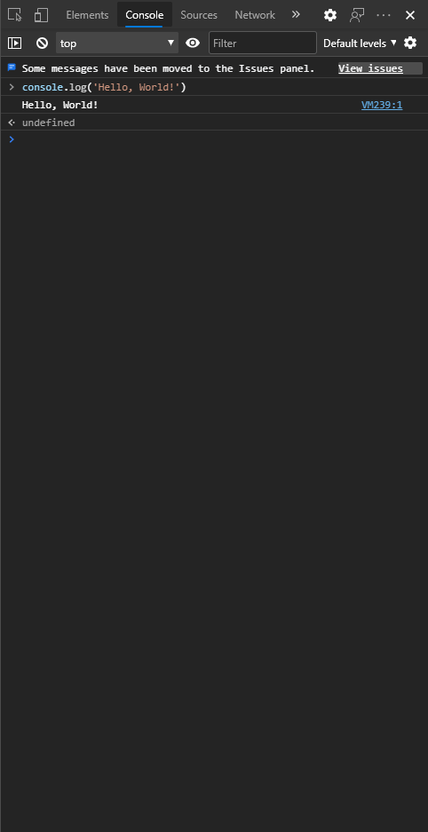

# Hello, World!

Hello, World 将是你的第一个 JavaScript 应用，它将在控制台输出一行字符——“Hello, World”。

## 配置开发环境

此应用不仅可以在 Node.js 环境下运行，也可以直接在浏览器环境里运行。因此，编写此应用的最简单的方式是使用浏览器的 JavaScript 控制台。

你可以打开浏览器的开发人员工具，并切换到“Console”页。

<!-- “Console”页的屏幕截图 -->



在“Console”页中输入 JavaScript 代码并按下回车键即可立即运行这行代码。那么现在就可以编写此应用了。

如果你想在 Node.js 环境中执行它，你需要先参阅[安装](./installation.md)。

## 编写代码

在 JavaScript 中，Hello, World! 仅需一行代码就可以完成：

```javascript
console.log('Hello, World!')
```

接下来你将需要运行此代码：

- [在浏览器开发人员工具中运行](#在浏览器开发人员工具中运行)
- [在 Node.js 中运行](#在-Node.js-中运行)

## 在浏览器开发人员工具中运行

输入源代码后，按下回车键即可得到以下结果：



此应用已成功向控制台输出了“Hello, World”。

## 在 Node.js 中运行

然后你将需要创建一个 JavaScript 源代码文件，如 `hello-world.js`，以下内容将以 `hello-world.js` 为文件名演示。

这时候，你将需要命令行中打开此目录，然后执行：

```sh
node ./hello-world.js
```

如果你还没有把代码输入到此文件，那么控制台中将什么也不会输出，因此你需要把代码输入到文件中再执行上述命令，此时控制台将会输出：

```output
Hello, World!
```

此时，应用也完成了任务。
