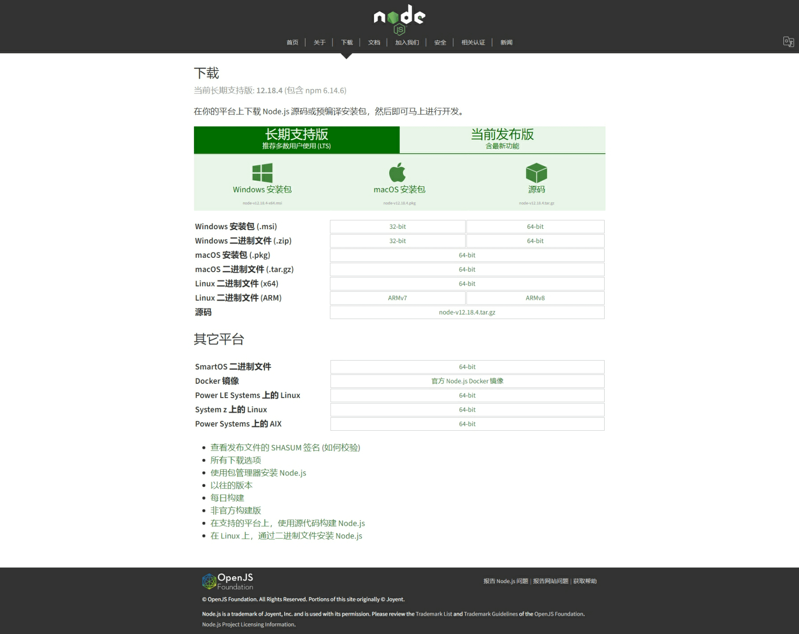

# 安装

在开始本章内容的学习前，你需要先安装 Node.js。

首先，前往 [Node.js 的官方网站](https://nodejs.org/zh-cn/)，进入[下载](https://nodejs.org/zh-cn/download/)页。

然后选择适合你的操作系统的版本并安装。

当然，你也可以使用 `apt`、`yum`、`brew`、`winget` 等包管理器安装。
