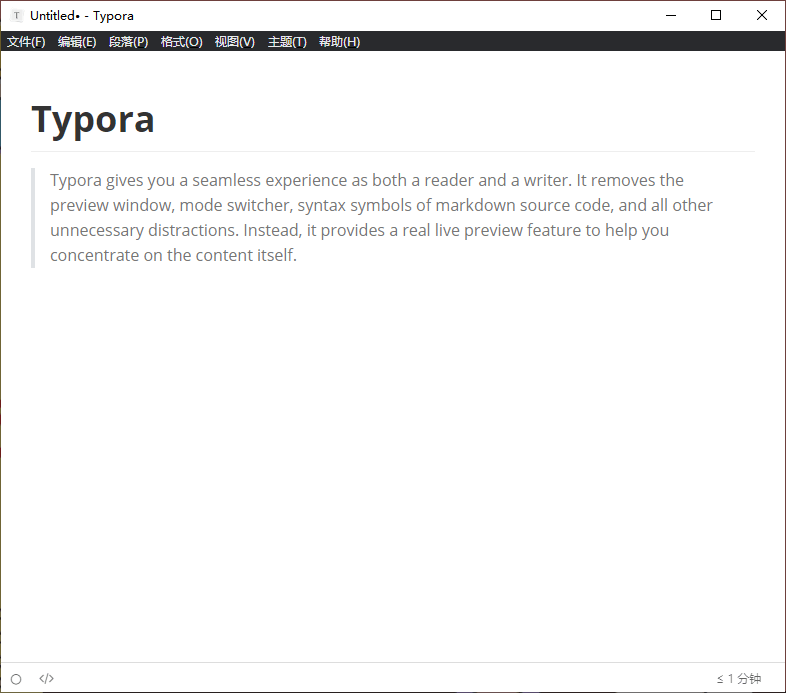

# Markdown

本指南使用 Markdown 语法，本文将介绍如何使用 Markdown。

Markdown 是一个标记语言，本文就是使用 Markdown 编写的。Markdown 可以快速创建美观的文档，只要你了解其语法，就可以使用。

## 配置编辑器

Markdown 文件扩展名一般为 `md`，你可以使用[纯文本](./plain-text.md)编辑器打开它。

你也可以使用其它主流 Markdown 编辑器，如 [Typora](#Typora)、[Obsidian](#Obsidian)，或[代码编辑器](./code-editors.md)。

主流代码编辑器都对与 Markdown 有很好的支持，比如 Visual Studio Code、Vim、Emacs 等。

### Typora



[Typora](https://typora.io/) 是一个纯粹的轻量级 Markdown 编辑器，安装非常简单，仅需按其安装程序指示操作即可安装成功。

### Obsidian


[Obsidian](https://obsidian.md/) 是一个非常强大 Markdown 编辑器，屏幕截图中展示了其 connections（连接）功能。

## 语法

[Daring Fireball: Markdown Basics](https://daringfireball.net/projects/markdown/basics) 中介绍了 Markdown 的基本语法，你也可以前往由 GitHub 撰写的 [Mastering Markdown · GitHub Guides](https://guides.github.com/features/mastering-markdown/) 以可视化的方式了解 Markdown 的常用语法。

### 文本

```markdown
It's very easy to make some words **bold** and other words *italic* with Markdown. You can even [link to Google!](http://google.com)
```

#### 效果

It's very easy to make some words **bold** and other words *italic* with Markdown. You can even [link to Google!](http://google.com)

<small>引自 [Mastering Markdown · GitHub Guides](https://guides.github.com/features/mastering-markdown/)</small>

### 标题

```markdown
# 一级标题
## 二级标题
### 三级标题
#### 四级标题
##### 五级标题
###### 六级标题
```

#### 效果

<div>
<h1>一级标题</h1>
<h2>二级标题</h2>
<h3>三级标题</h3>
<h4>四级标题</h4>
<h5>五级标题</h5>
<h6>六级标题</h6>
</div>

### 列表

```markdown
- 无序列表项
- 无序列表项
- 无序列表项

1. 有序列表项
2. 有序列表项
3. 有序列表项

- [ ] 任务列表项
- [x] 任务列表项
- [ ] 任务列表项
```

#### 效果

- 无序列表项
- 无序列表项
- 无序列表项

1. 有序列表项
2. 有序列表项
3. 有序列表项

- [ ] 任务列表项
- [x] 任务列表项
- [ ] 任务列表项

### 图片

```markdown

```

#### 效果


### 引用

```markdown
> Lorem ipsum dolor sit amet, consectetur adipiscing elit. Cras sed ullamcorper est, ut bibendum metus. Suspendisse aliquet dui nec auctor ultrices.
```

#### 效果

> Lorem ipsum dolor sit amet, consectetur adipiscing elit. Cras sed ullamcorper est, ut bibendum metus. Suspendisse aliquet dui nec auctor ultrices.

### 行内代码

```markdown
这是 Node.js 中的 `require`
```

#### 效果

这是 Node.js 中的 `require`

### 代码块

```javascript
var a = 'string';
const b = '++';
a = a + b; //'string++'
```

### 表格

```markdown
| First Header | Second Header |
| ------------ | ------------- |
| Content from cell 1 | Content from cell 2 |
| Content in the first column | Content in the second column |
```

#### 效果

| First Header | Second Header |
| ------------ | ------------- |
| Content from cell 1 | Content from cell 2 |
| Content in the first column | Content in the second column |

## 参考文献

- [Daring Fireball: Markdown Basics (daringfireball.net)](https://daringfireball.net/projects/markdown/basics)
- [Mastering Markdown · GitHub Guides (guides.github.com)](https://guides.github.com/features/mastering-markdown/)
