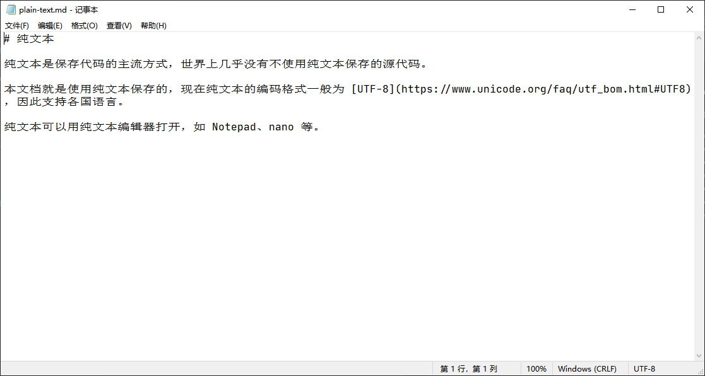

# 纯文本

纯文本是保存代码的主流方式，世界上几乎没有不使用纯文本保存的源代码。

本文档就是使用纯文本保存的，现在纯文本的编码格式一般为 [UTF-8](https://www.unicode.org/faq/utf_bom.html#UTF8)，因此支持各国语言。

纯文本可以用纯文本编辑器打开，如 Notepad、nano 等。

纯文本可以被 [Git](./git.md) 轻松跟踪更改，为你的代码仓库提供历史记录，随时可以撤销更改。
